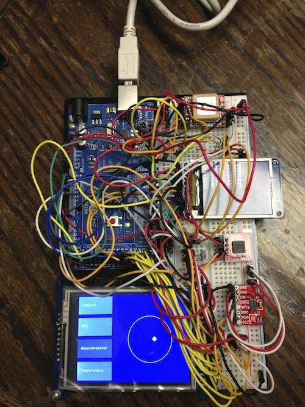

#I2C Interface
Git repository at [https://github.com/Wyattjoh/I2C_Devices](https://github.com/Wyattjoh/I2C_Devices).

Wyatt Johnson - 1230799

###Notes on in-class comments
As the definitions of all the source is done in C++ classes, the function descriptions are not located beside the function, rather it is located in the class definition itself.


##Components
---
Listed components:

1. Arduino - *MEGA 2560*
2. GPS - *GTPA010*
3. LCD Screen - *ST7735*
4. Digital Compass - *HMC6352*
5. Accelerometer - *ADXL345*

##Pictures
---
Orientation diagram:

##Wiring
---
The wiring specifications are specified with the source from the device on the left and the Arduino on the right, as such:

```
GPS        Arduino
--------------------
VCC   ->   5V
```
Where `-` indicates no Arduino pin affiliation.

The following convention will be used when referring to the I2C interfaces:

```
Digital Compass    Arduino
----------------------------
SCL  ->  PIN(1) -> SCL
SDA  ->  PIN(2) -> SDA
```

Where `PIN (#)` indicates that there is a component that requires a connection with another besides the Arduino, and that these share the same line on the breadboard, connect any devices that have the same `PIN (#)` definition onto the same line on the breadboard.

###GPS - *GTPA010*

```
GPS          Arduino
----------------------
VCC     ->   5V
ENABLE  ->   D12
GND     ->   GND
VBACKUP ->   3.3V
3D-FIX  ->   D2
RXD     ->   D16
TXD     ->   D17
GND     ->   GND
DMINUS  ->   -
DPLUS   ->   -
```

###LCD Screen - *ST7735*

```
LCD Screen        Arduino
----------------------------
LITE         ->   5V
MISO         ->   D50
SCK          ->   D52
MOSI         ->   D51
TFT_CS       ->   D34
CARD_CS      ->   D33
D/C          ->   D7
RESET        ->   D32
VCC          ->   5V
GND          ->   GND
```

###Digital Compass - *HMC6352*

```
Digital Compass    Arduino
----------------------------
SCL  ->  PIN(1) -> SCL
SDA  ->  PIN(2) -> SDA
VCC             -> 3.3V
GND             -> GND
```
###Accelerometer - *ADXL345*

```
Accelerometer      Arduino
-----------------------------
GND            ->  GND
VCC            ->  3.3V
CS             ->  3.3V
INT1           ->  -
INT2           ->  -
SDO            ->  3.3V
SDA  -> PIN(2) -> SDA
SCL  -> PIN(1) -> SCL
```
###TFTLCD Touch Screen - *TFTLCD*

The screen must be oriented such that its left side is at the bottom of the Arduino board as shown in the attached pictures.

```
TFTLCD           Arduino
-----------------------------
D7         ->    D29
D6         ->    D28
D5         ->    D27
D4         ->    D26
D3         ->    D25
D2         ->    D24
D1         ->    D23
D0         ->    D22
Y-         ->    A15
X-         ->    D30
Y+         ->    A14
X+         ->    D31
Backlight  ->    5V
RST        ->    RESET
RD         ->    A0
WR         ->    A1
C/D        ->    A2
CS         ->    A3
3-5V       ->    5V
GND        ->    GND
```

###Thermistor - *T36GZ*
The wiring is based on having the flat side facing you.

```
Thermistor     Arduino
------------------------
Left pin   ->  5V
Center pin ->  A7
Right pin  ->  GND
```

###Tri-color LED
The wiring is based on having the flat side facing away you, numbered from 0-3 starting with the closest pin.

```
Tri-color LED                  Arduino
---------------------------------------
Pin 0  -> 560 Ohm Resistor ->  D11
Pin 1  -> 560 Ohm Resistor ->  D9
Pin 2                      ->  GND
Pin 3  -> 560 Ohm Resistor ->  D10
```

##Instructions
---
The I2C Interface project provides a set of data logging methods, sensor communication, and sensor validation classes with the goal of recording said data for any miscellaneous purpose. The project implements a touch screen to provide an interface in-between the hardware and the user to select functions without the need to recompile.


###Starting the device
1. Copy the maps that are located in the `maps` directory onto the SD card
1. Wire the device as described in the wiring section of this document
2. Insert a properly formatted SD card with the provided `uofa.bmp` file on it
3. Power the device with a battery pack or USB connection
4. The Arduino will start up into mode select mode, choose a function on the touch screen to display data

###Viewing Compass Data
The compass display will show a ring with a small red circle that indicates the direction of magnetic north. The small LCD screen will constantly print out the data as it is read.

If you tilt the device enough, the LED status indicator will turn red, indicating that you have tilted the device too much, and compass measurements are not guaranteed to be accurate, as the measurements are designed to be taken in the plane tangential to the Earth's surface.

1. Start the device as described in this section of the document
2. Press (Works best with your fingernail) the button titled `Compass`

###Viewing GPS Data
Once a GPS lock has been acquired, the large TFTLCD screen will display a OpenStreetview map if the available map file `uofa.bmp` is available and the GPS determines that you are within the maps designed boundaries. Additional maps can be added, although this requires that the source code be recompiled with said map and GPS information to make it available to the GPS.

The map will be centred on the current detected location, and will display the recorded location on the map, leaving a trail of a darker blue where the GPS had been before. The accuracy of the provided *GTPA010* GPS is `+/- 5m`, so even standing still might result in some drift.

If you venture outside the frame of the screen, but within the bounds of the available map data (North campus), the Arduino will reload the map on the current location (centred), and clear the previous track recorded on the old frame. This is out of design, as it was impractical to have a device which is designed to record information to the SD card also have to constantly re-read said recorded data in the same file for previous tracks. Future designs might incorporate this feature.

1. Start the device as described in this section of the document
2. Press (Works best with your fingernail) the button titled `GPS`

###Viewing Accelerometer Data
The design of the accelerometer pane shows the current position of up would be relative to a ball. To imagine this, picture a ball, where there is a yellow dot on the top, where regardless of how you re-orient the device, the yellow ball will stay on top, this is what the display simulates.

If you tilt the device too far, the yellow dot <u>will</u> go out of the bounds of the white circle; this behaviour is designed. If the Yellow ball was mapped to exist only within the white circle, the visualization would not allow the small yellow ball to move much, hence the mapped magnitude has been expanded to display the movements with increased sensitivity.

1. Start the device as described in this section of the document
2. Press (Works best with your fingernail) the button titled `Accelerometer`
 
###Viewing Temperature Data
Due to recored data from the Temperature sensor that I analyzed, as well as the calibration curves that were provided from the manufacturer, I have determined that due to the number of devices that are connected, the electrical interference that is generated is enough to distort the sensitive voltage measurements from the thermistor to the analog pin of the Arduino. Accurate values are generally recorded when the device is stable.

1. Start the device as described in this section of the document
2. Press (Works best with your fingernail) the button titled `Temperature`

###Recording Data
Data is recorded automatically as soon as a GPS lock is successful. It has been designed this was as to assure that the recorded data has both a location, and a time stamp as provided from the GPS device. The flashing blue LED on the device will indicate that data is currently being written to the onboard SD card.

###Troubleshooting

* If the device has started, but is not displaying buttons, and is instead displaying "Failed to initialize SD card!", it indicates that the SD card is either not inserted, or is formatted incorrectly.
	* *Solution*
		1. Unplug the Arduino from power
		2. Remove the SD Card from the LCD screen (if attached)
		3. Insert the SD Card into a computers SD card slot
		4. When the device shows up, eject the device, and reinsert it into the LCD screen on the Arduino

##Code
---
Sensor Classes:

*  Sensors
	*  ADXL345
	*  HMC6352
	*  T36GZ.h
	*  GTPA010

Display Classes:

* MapData
* Displays
	* DADXL345
	* DHMC6352
	* DT36GZ
	* DGTPA010

Data Classes:

* DataLog